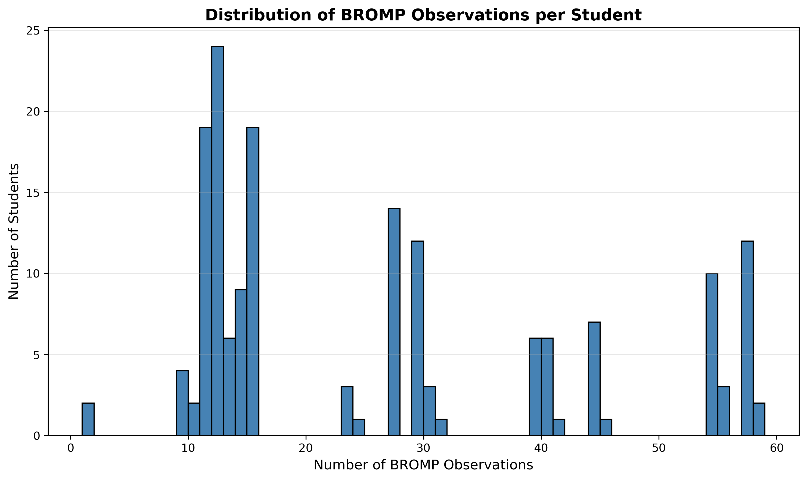
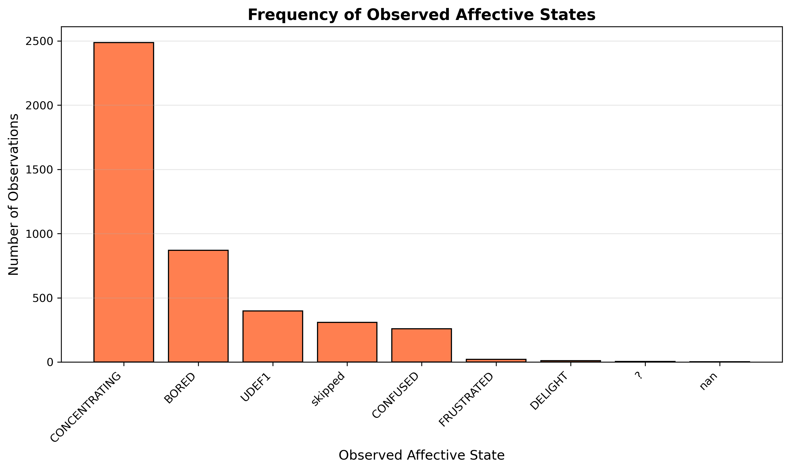
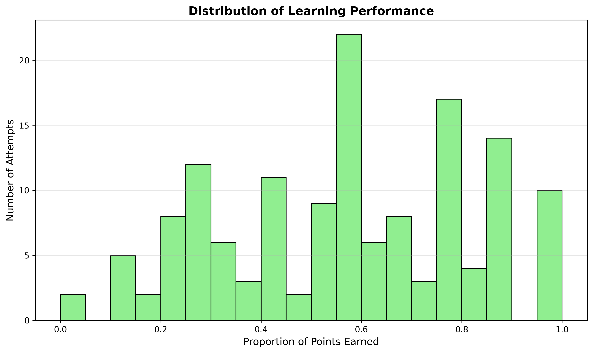
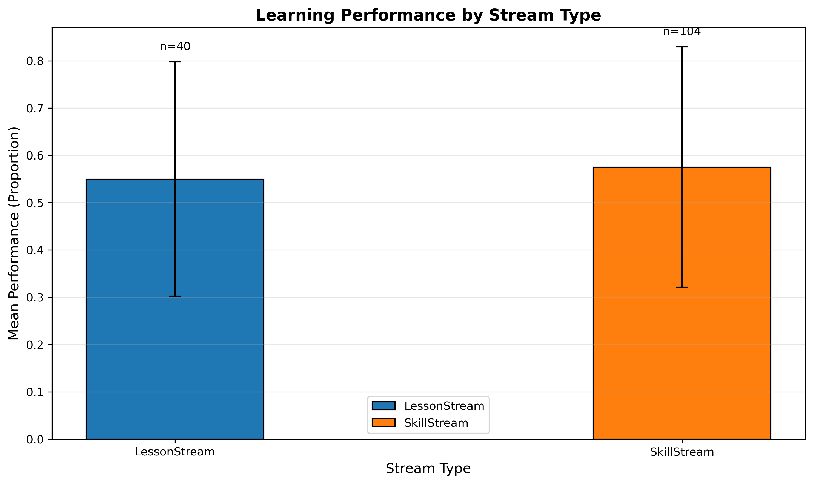

# EDA Summary Memo

**Author:** Dasey Dang (UW–Madison MS in Psychology: Data Science & Human Behavior)
**Initial EDA by:** Emily Huffaker
**Date:** October 7, 2026
**Project:** Carnegie Learning Capstone

## Overview

This memo summarizes the exploratory data analysis (EDA) conducted on the Carnegie Learning datasets. The EDA examines the structure and characteristics of available data to understand student representation, affective state distributions, and learning performance patterns.

## Data Overview

| Dataset | Records | Unique Students | Description |
|---------|---------|-----------------|-------------|
| BROMP | 4,357 observations | 167 students | Baker-Rodrigo Observation Method Protocol (affective states) |
| Attempt | 284 attempts | 148 students | Learning attempt records with scores |
| APLSE | 163 records | 163 students | Additional performance metrics |
| Caliper | 15,386 events | 163 students | Detailed platform event logs |

## Key Findings

### 1. BROMP Observation Distribution

- **Mean:** 26.1 observations per student
- **Range:** 1 to 58 observations per student
- **Median:** 15 observations per student
- **Distribution:** Right-skewed, with most students having 12-39 observations

### 2. Affective State Distribution

- **CONCENTRATING:** 2,488 observations (57.1%) - Most common
- **BORED:** 869 observations (20.0%)
- **CONFUSED:** 258 observations (5.9%)
- **UDEF1:** 397 observations (9.1%) - Undefined state
- **skipped:** 308 observations (7.1%)
- **FRUSTRATED:** 20 observations (0.5%) - Rare
- **DELIGHT:** 10 observations (0.2%) - Rare

**Note:** Negative affective states (FRUSTRATED, CONFUSED) represent only 6.4% of observations, which may limit analysis of behavioral responses to difficulty.

### 3. Learning Performance Distribution

- **Completed attempts with scores:** 144 out of 284 attempts (50.7%)
- **Students with completed attempts:** 95 students
- **Mean performance:** 0.568 (56.8% of points earned)
- **Median performance:** 0.578 (57.8% of points earned)
- **Standard deviation:** 0.252
- **Range:** 0.0 to 1.0

### 4. Performance by Stream Type

- **LessonStream:** 40 attempts, mean = 0.549
- **SkillStream:** 104 attempts, mean = 0.575
- **Difference:** Minimal (0.026), suggesting stream type is not a major source of performance variation

## Data Quality Notes

- **SCOREMAXIMUM validation:** No zero values found; 140 missing values correspond to IN_PROGRESS attempts
- **BROMP time reconstruction:** Observations include session start time (ntp_time) and offset (msoffsetfromstart) for precise timestamp reconstruction
- **Caliper event linkage:** 11,951 Caliper events include attempt IDs, suggesting potential for linking BROMP observations to specific learning attempts

## Limitations for Research Question

The research question examines how students behave after encountering difficulty and how those behaviors relate to recovery or later performance. Current data limitations include:

1. **Rare difficulty observations:** Only 278 FRUSTRATED/CONFUSED observations (6.4% of total)
2. **Incomplete attempt linkage:** Only 50.7% of attempts have completion and score data
3. **Temporal ambiguity:** Linking BROMP observations to specific attempts requires careful timestamp matching

## Next Steps

1. Validate BROMP-to-Caliper timestamp matching (4-hour adjustment investigation)
2. Assess whether difficulty observations can be reliably linked to attempt outcomes
3. Consider alternative analysis approaches if difficulty sample size remains limited

## Files Generated

- `bromp_observations_per_student.png` - Distribution of observations per student
- `affective_states_distribution.png` - Frequency of each affective state
- `performance_distribution.png` - Distribution of attempt performance scores
- `performance_by_stream_type.png` - Performance comparison by stream type

---

*EDA initially prepared by Emily Huffaker. Figures generated by Dasey Dang. Data files remain in local `data/` directory and are not committed to version control.*
